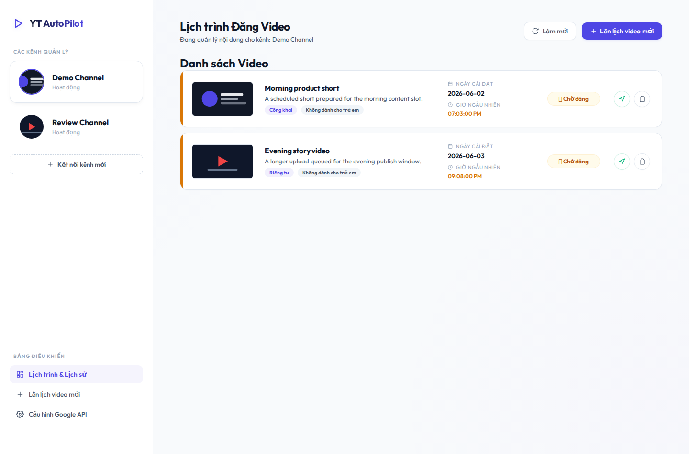

# YouTube Auto Scheduler

Short GitHub description:

> A self-hosted dashboard for scheduling original-quality video uploads across multiple YouTube channels.



## Overview

YouTube Auto Scheduler is a small full-stack app for managing scheduled uploads to multiple YouTube channels. It stores uploaded videos locally, keeps the original video file untouched, and publishes through the YouTube Data API at the configured time.

## Features

- Multi-channel YouTube account management with OAuth.
- Randomized publish window around a target time.
- Original video file storage without local compression or transcoding.
- Optional custom thumbnail upload.
- Automatic video preview image when no thumbnail is provided.
- Manual "publish now" action.
- Production service support with Nginx reverse proxy.

## Stack

- Backend: Node.js, Express, Google APIs, node-schedule.
- Frontend: React, TypeScript, Vite.
- Storage: JSON file database plus local upload directory.
- Service: systemd + Nginx.

## Quick Start

```bash
cd backend
npm install

cd ../frontend
npm install

cd ..
./run-server.sh
```

Public service path:

```text
https://your-domain.example/youtube_auto_schedule/
```

## Runtime Data

Runtime files are intentionally kept out of Git:

```text
backend/data/db.json
backend/data/uploads/
```

Back up both together when moving servers.

## Useful Commands

```bash
./restart-service.sh
curl -s https://your-domain.example/youtube_auto_schedule/api/health
journalctl -u youtube-auto-scheduler -f
```

## Google OAuth

Authorized redirect URI:

```text
https://your-domain.example/youtube_auto_schedule/api/auth/callback
```

See [RUN.md](RUN.md) for deployment and service checks.
